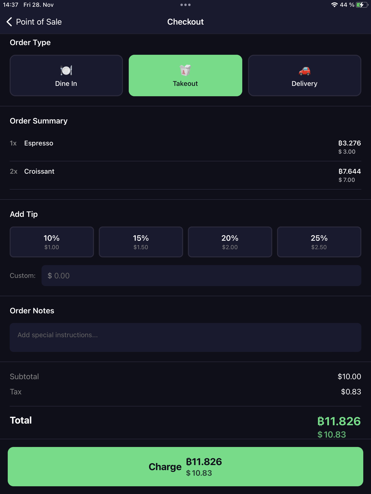
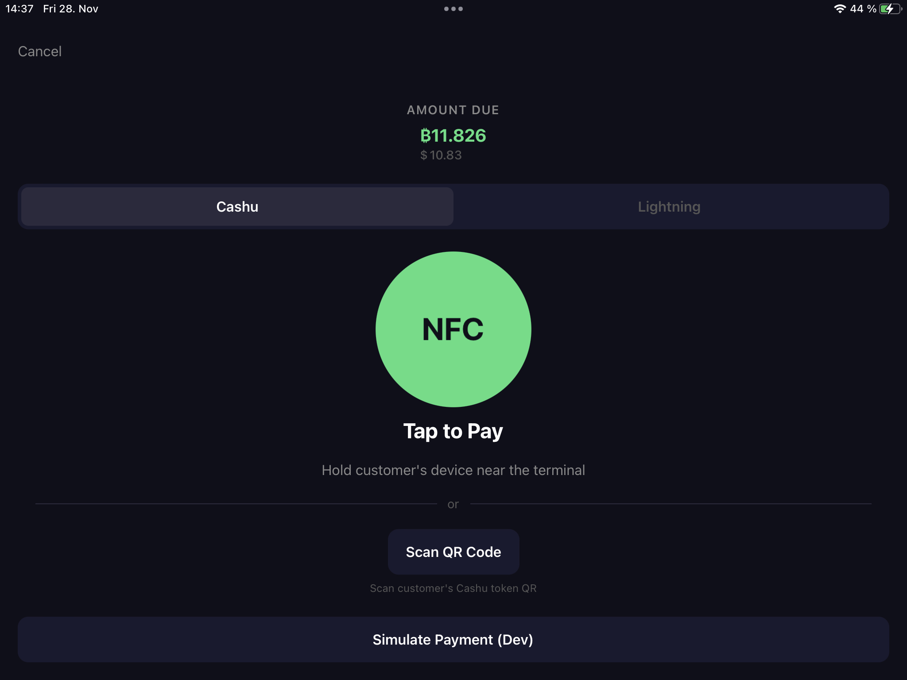
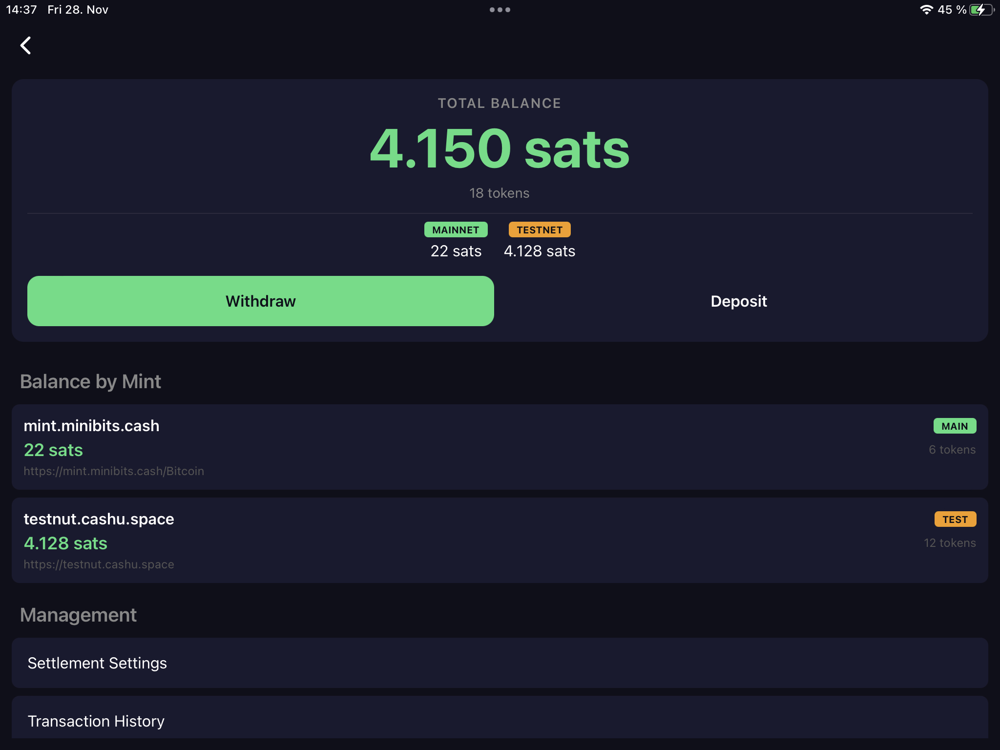

# Cashu Point of Sale system

A self-hosted payment processing system using Cashu ecash, enabling Lightning-compatible payments with NFC tap-to-pay support.

> **Note:** This project is designed for mobile devices and requires **Expo Go** on iOS or Android. It does **not** support web browsers due to native dependencies like NFC and secure storage.

## Features

- **NFC Tap-to-Pay** - Accept Cashu tokens via NFC for instant payments
- **Lightning Integration** - Generate Lightning invoices via Cashu mints
- **Dual Payment Support** - Accept both NFC and Lightning payments simultaneously
- **Wallet Integration** - Built-in Cashu wallet for managing ecash
- **Offline Support** - Queue payments when offline, process when back online
- **Full POS System** - Product catalog, cart, modifiers, and tips
- **Restaurant Features** - Table management, order tracking, and kitchen display
- **Live Exchange Rates** - Real-time BTC/fiat conversion
- **Receipt Printing** - Generate and print HTML/PDF receipts
- **Refund Processing** - Full and partial refunds with QR code tokens
- **Transaction Export** - CSV/JSON export for accounting
- **Multi-Terminal Sync** - Synchronize data across terminals via Nostr relays
- **Device Approval** - Secure multi-device management system

## Screenshots

| Home Screen | POS Interface |
|:---:|:---:|
|  |  |

| Checkout | Payment Processing |
|:---:|:---:|
|  |  |

| Admin Dashboard | Sync Settings |
|:---:|:---:|
|  |  |

## Why Cashu for Payments?

| Feature | Lightning (Direct) | Cashu |
|---------|-------------------|-------|
| Offline payments | No | Yes |
| NFC tap-to-pay | Difficult | Native |
| Privacy | Pseudonymous | Blind signatures |
| Receiver online | Required | Not required |
| Payment latency | 1-10 seconds | Instant (offline) |
| Self-custody | Yes | Custodial (trust mint) |

The tradeoff is clear: Cashu sacrifices self-custody for better UX. For small-to-medium payments, this is often acceptable.

## Project Structure

```
cashu-pos/
├── app/                    # Screens (Expo Router)
│   ├── index.tsx           # Home screen
│   ├── onboarding.tsx      # Initial setup flow
│   ├── amount.tsx          # Amount entry
│   ├── payment.tsx         # NFC/Lightning payment
│   ├── result.tsx          # Payment result
│   ├── pos/                # POS catalog & checkout
│   ├── admin/              # Admin dashboard (deposit, withdraw, export)
│   ├── settings/           # Configuration screens
│   ├── history/            # Transaction history
│   └── refund/             # Refund processing
├── src/
│   ├── components/         # UI components
│   ├── services/           # Business logic
│   │   ├── cashu.service.ts
│   │   ├── nfc.service.ts
│   │   ├── payment-processor.service.ts
│   │   ├── exchange-rate.service.ts
│   │   ├── receipt.service.ts
│   │   ├── refund.service.ts
│   │   ├── nostr.service.ts         # Nostr relay client
│   │   ├── sync.service.ts          # Multi-terminal sync
│   │   ├── sync-integration.ts      # Store bridge
│   │   ├── database.service.ts      # SQLite local storage
│   │   ├── device-approval.service.ts
│   │   ├── feedback.service.ts
│   │   ├── logger.service.ts
│   │   ├── offline-queue.service.ts
│   │   ├── order.service.ts
│   │   ├── seed.service.ts
│   │   └── token-forward.service.ts
│   ├── store/              # Zustand state management
│   ├── types/              # TypeScript interfaces
│   └── theme/              # Design tokens
├── docs/                   # Technical documentation (18+ detailed guides)
│   ├── 01-cashu-protocol.md
│   ├── 02-nfc-payment-flow.md
│   ├── 03-system-architecture.md
│   ├── ARCHITECTURE.md
│   ├── NOSTR-SYNC.md
│   ├── IMPLEMENTATION_SUMMARY.md
│   ├── UX_IMPROVEMENTS.md
│   └── ...
└── README.md
```

## Quick Start

### Prerequisites

- Node.js 18+
- Expo CLI (`npm install -g expo-cli`)
- iOS/Android device or emulator (NFC requires physical device)

### Installation

```bash
# Clone the repository
git clone https://github.com/babdbtc/cashu-pos.git
cd cashu-pos

# Install dependencies
npm install

# Start the development server
npx expo start
```

### Configuration

1. **Add a Cashu Mint** - Go to Settings > Mint Configuration and add a trusted mint URL
2. **Set Display Currency** - Configure your preferred fiat currency in Settings > Currency
3. **Enable Offline Mode** - Optional: Configure offline payment limits in Settings > Offline

## Multi-Terminal Sync

CashuPay supports synchronizing data across multiple POS terminals using [Nostr](https://nostr.com/) relays. This enables:

- **Shared product catalog** - Update products on one terminal, sync to all
- **Unified transaction history** - View all sales from any terminal
- **Decentralized** - No central server required, uses public Nostr relays
- **Offline-first** - Local SQLite database with sync queue

### How It Works

```
┌─────────────────────────────────────────────────┐
│              Nostr Relay Network                │
└─────────────────────────────────────────────────┘
          ▲             ▲             ▲
    ┌─────┴─────┐ ┌─────┴─────┐ ┌─────┴─────┐
    │ Terminal 1 │ │ Terminal 2 │ │ Terminal 3 │
    │  (Main)    │ │   (Sub)    │ │   (Sub)    │
    │  SQLite    │ │  SQLite    │ │  SQLite    │
    └────────────┘ └────────────┘ └────────────┘
```

Each terminal:
1. Maintains a local SQLite database for offline operation
2. Publishes changes as signed Nostr events to relays
3. Subscribes to events from other terminals in the same merchant network
4. Resolves conflicts using version numbers and timestamps

### Enabling Sync

1. Complete the onboarding flow (set merchant name, terminal name)
2. Go to **Settings > Sync**
3. Toggle **Sync Active** on
4. The terminal generates a Nostr keypair and begins syncing

### Sync Configuration

| Setting | Default | Description |
|---------|---------|-------------|
| Auto Sync | On | Automatically sync when changes occur |
| Sync Interval | 30 seconds | How often to check for pending events |
| Retry Delay | 5 seconds | Wait time before retrying failed publishes |

### Default Relays

The app connects to these public Nostr relays:
- `wss://relay.damus.io`
- `wss://nos.lol`
- `wss://relay.nostr.band`
- `wss://nostr.wine`

For detailed technical documentation, see [docs/NOSTR-SYNC.md](docs/NOSTR-SYNC.md).

### Testing Payments

1. Navigate to the home screen and tap "Quick Payment"
2. Enter an amount and tap "Continue"
3. The payment screen shows two options:
   - **Cashu (NFC)**: Tap an NFC tag containing Cashu tokens
   - **Lightning**: Display QR code for Lightning invoice payment

## Tech Stack

- **Framework**: Expo 54 / React Native 0.81 / React 19.1
- **Routing**: Expo Router (file-based)
- **State**: Zustand with persist middleware
- **Backend**: Supabase (optional), React Query
- **Cashu**: @cashu/cashu-ts
- **NFC**: react-native-nfc-manager
- **Storage**: AsyncStorage (local storage), Expo SQLite (local DB), Expo Secure Store (sensitive data)
- **Sync**: nostr-tools (Nostr protocol)
- **Crypto**: @scure/bip32, @scure/bip39 (wallet seed generation)

## Core Components

| Component | Status | Description |
|-----------|--------|-------------|
| POS Terminal | Functional | NFC-enabled payment terminal app |
| Mint Server | External | Use existing Cashu mint software |
| Merchant Backend | Planned | Payment processing & accounting |
| Customer Wallet | Planned | Mobile app for holding ecash |

## Documentation

See the `docs/` folder for detailed technical documentation (18+ comprehensive guides):

**Core Concepts:**
- [Cashu Protocol](docs/01-cashu-protocol.md) - Ecash fundamentals
- [NFC Payment Flow](docs/02-nfc-payment-flow.md) - How NFC payments work
- [System Architecture](docs/03-system-architecture.md) - Overall design
- [Security](docs/06-security.md) - Security considerations

**POS Features:**
- [POS Terminal](docs/05-pos-terminal.md) - Terminal implementation
- [POS Checkout System](docs/11-pos-checkout-system.md) - Checkout flow
- [Product Catalog](docs/13-product-catalog.md) - Product management
- [Cart and Orders](docs/14-cart-and-orders.md) - Order processing
- [Inventory Management](docs/15-inventory-management.md) - Stock tracking
- [Customers and Loyalty](docs/16-customers-and-loyalty.md) - Customer management
- [Reporting Analytics](docs/17-reporting-analytics.md) - Business insights

**Advanced Topics:**
- [Multi-Terminal Sync](docs/18-multi-terminal-sync.md) - Nostr-based sync
- [Nostr Sync](docs/NOSTR-SYNC.md) - Sync protocol details
- [Refunds and Permissions](docs/09-refunds-and-permissions.md) - Refund handling
- [Currency and Taxes](docs/07-currency-and-taxes.md) - Multi-currency support
- [Architecture](docs/ARCHITECTURE.md) - Technical architecture
- [Implementation Summary](docs/IMPLEMENTATION_SUMMARY.md) - Current status
- [UX Improvements](docs/UX_IMPROVEMENTS.md) - User experience enhancements

## Related Projects

- [Cashu](https://cashu.space) - Ecash protocol
- [Nutshell](https://github.com/cashubtc/nutshell) - Python Cashu mint/wallet
- [cashu-ts](https://github.com/cashubtc/cashu-ts) - TypeScript Cashu library
- [CDK](https://github.com/cashubtc/cdk) - Cashu Development Kit (Rust)

## License

MIT
